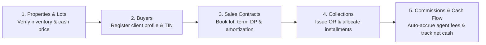

# JLD Subdivision Management System
## Accountant's Operating Manual & First-Time User Guide

Welcome to the **JLD Subdivision Management System**. This guide provides an end-to-end operational walkthrough tailored specifically for an **Accountant or Financial Officer** navigating the platform for the first time.

---

## Table of Contents
1. [Core Accounting Principles & System Architecture](#1-core-accounting-principles--system-architecture)
2. [First-Time Quick Start & Workspace Layout](#2-first-time-quick-start--workspace-layout)
3. [The 5-Step Connected Financial Workflow](#3-the-5-step-connected-financial-workflow)
4. [Detailed Module-by-Module Guide](#4-detailed-module-by-module-guide)
   - [4.1 Properties & Lots (`products`)](#41-properties--lots)
   - [4.2 Buyers (`stakeholder`)](#42-buyers)
   - [4.3 Sales Contracts (`contracts`)](#43-sales-contracts)
   - [4.4 Collections & Official Receipts (`payment`)](#44-collections--official-receipts)
   - [4.5 Agents & Commissions (`agents-commissions`)](#45-agents--commissions)
   - [4.6 Employees (`employees`)](#46-employees)
   - [4.7 Loans & Benefits (`loans-benefits`)](#47-loans--benefits)
   - [4.8 Payroll & Payslips (`payroll`)](#48-payroll--payslips)
   - [4.9 Expenses (`expenses`)](#49-expenses)
   - [4.10 Cash Flow & Reports (`reports`)](#410-cash-flow--reports)
   - [4.11 Printable Accounts & Workbook SOA (`printable-accounts`)](#411-printable-accounts--workbook-soa)
5. [Auditing, Guard Rails & Soft-Delete Architecture](#5-auditing-guard-rails--soft-delete-architecture)
6. [Accountant’s Daily, Bi-Weekly & Monthly Checklist](#6-accountants-daily-bi-weekly--monthly-checklist)

---

## 1. Core Accounting Principles & System Architecture

As an accountant, understanding the mathematical and structural logic of this system is essential. The workspace enforces five foundational accounting rules:

1. **Cash Basis Cash Flow**:
   - Cash Inflows are recognized **only** upon issuance of an Official Receipt (OR) under **Collections**.
   - Cash Outflows are recognized **only** upon generation of an authorized voucher under **Expenses**.
   - Payroll generation and commission accruals **do not move cash** until an actual cash/check disbursement expense voucher is created.
2. **Statement of Account (SOA) Balance Formula**:
   $$\text{Remaining Balance} = \text{Contract Lot Price} - \text{Contract Down Payment} - \sum(\text{Installment Payments} + \text{Full Settlement Payments})$$
   - Down Payment (DP) receipts confirm the opening contractual credit—they are **never double-deducted** from the balance.
   - Unapplied reservation deposits remain noted on the account until formally credited or applied.
3. **Strict Receipt Uniqueness & Line-Item Integrity**:
   - Every Official Receipt number (`orderreceipt`) must be unique across both active and archived transactions.
   - A single receipt can have multiple line items (e.g., Downpayment, Monthly Installment, Penalty), but **all items on a receipt must belong to the same buyer**.
4. **Automated Commission Accrual**:
   - When a collection payment is recorded for a contract, the assigned agent’s commission is automatically calculated:
     $$\text{Commission Earned} = \text{Collection Amount} \times \text{Agent Commission Percentage}$$
   - This amount immediately credits the agent's available balance. When disbursed, a corresponding expense voucher is cut.
5. **Non-Reversing Soft-Delete (Audit Trail Integrity)**:
   - Archiving a receipt or contract does not silently distort historical cash totals. Deletions require strict dependency validation (e.g., you cannot delete a property that has active contracts or receipts attached).

---

## 2. First-Time Quick Start & Workspace Layout

When you log into the platform, the interface is split into three main areas:

```
┌─────────────────────────┬────────────────────────────────────────────────────────────────────────┐
│   JLD WORKSPACE         │  TOP HEADER: Current Tab Name  •  System Notifications  •  User Email │
│   PROPERTY MANAGEMENT   ├────────────────────────────────────────────────────────────────────────┤
│                         │                                                                        │
│  PROPERTY & SALES       │  DYNAMIC WORKSPACE VIEW                                                │
│  • Properties & lots    │  - Summary KPI Metric Cards (Inflow, Outflow, Net, Active Contracts)  │
│  • Buyers               │  - Action Buttons (Record Payment, New Contract, Export CSV)          │
│  • Sales contracts      │  - Filterable Data Tables & Ledgers                                    │
│  • Collections          │                                                                        │
│                         │                                                                        │
│  SALES PARTNERS         │                                                                        │
│  • Agents & commissions │                                                                        │
│                         │                                                                        │
│  PEOPLE & PAYROLL       │                                                                        │
│  • Employees            │                                                                        │
│  • Loans & benefits     │                                                                        │
│  • Payroll & payslips   │                                                                        │
│                         │                                                                        │
│  FINANCE                │                                                                        │
│  • Expenses             │                                                                        │
│  • Cash flow & reports  │                                                                        │
│                         │                                                                        │
│  [Reset to clean state] │                                                                        │
└─────────────────────────┴────────────────────────────────────────────────────────────────────────┘
```

### Where to Start Each Morning:
1. Navigate to **Business Overview** (the landing screen).
2. Review the **"Needs your attention"** panel:
   - **Contracts to review**: Highlights active accounts reaching or past their payment due date with outstanding balances.
   - **Pending payroll records**: Reminds you of drafts waiting for review and approval.
   - **Commission balances**: Shows accumulated agent commissions ready for release.

---

## 3. The 5-Step Connected Financial Workflow

For real estate operations, transactions flow sequentially across modules:



---

## 4. Detailed Module-by-Module Guide

### 4.1 Properties & Lots
**Location**: Sidebar → *PROPERTY & SALES* → **Properties & lots** (`products`)

#### What You Can Do as an Accountant:
1. **View Project Inventory**:
   - Monitor total blocks, total lots, and total land area (sq. m.) across subdivisions (e.g., Sto. Niño, Norala Phase 1 & 2, Tupi Commercial, Surallah).
   - Check the **Cash Price** established for each project phase.
2. **Track Inventory Utilization & Phasing**:
   - The system automatically calculates **Available Lots**:
     $$\text{Available Lots} = \text{Total Lots} - \text{Active Sold Lots (Contracts)}$$
   - **Phase Status**:
     - **Open**: Active inventory with > 15% lots available.
     - **Nearly Sold**: When available lots fall to $\le 15\%$ of total lots.
     - **Completed**: When 0 lots remain or the phase is officially archived.
3. **Audit Constraints**:
   - You **cannot archive** a property project if active sales contracts or client payments are attached to it.

---

### 4.2 Buyers
**Location**: Sidebar → *PROPERTY & SALES* → **Buyers** (`stakeholder`)

#### What You Can Do as an Accountant:
1. **Register New Clients**:
   - Click **`+ Add Buyer`** to capture personal, tax, and legal details: Full Name, Address, Contact Number, Email, Occupation, TIN, Civil Status, and Spouse Name.
2. **Execute Direct Lot Application**:
   - On any client row, click the **`Apply for lot`** button to immediately open a pre-filled Sales Contract form for that buyer.
3. **Review Client Purchase History**:
   - Click **`View history`** to inspect the audit log of all updates made to the client's record.
4. **Archive Protection**:
   - Clients with active contracts or payments cannot be deleted or archived until accounts are settled or properly transferred.

---

### 4.3 Sales Contracts
**Location**: Sidebar → *PROPERTY & SALES* → **Sales contracts** (`contracts`)

#### What You Can Do as an Accountant:
1. **Create / Book a New Lot Contract**:
   - Click **`New contract`** to open the Lot Purchase Application Modal.
   - Select the **Buyer**, **Property/Subdivision**, **Block No.**, and **Lot No.**.
   - Input the financial parameters:
     - **Lot Price (PHP)**: Total contract price.
     - **Down Payment (PHP)**: Required initial equity.
     - **Payment Terms**: 1 to 5 years (or Spot Cash).
     - **Monthly Amortization (PHP)**: Scheduled monthly payment.
     - **Monthly Due Date**: Day of the month when installments are due.
     - **Assigned Agent & Commission Rate (%)**: Automatically calculates agent payout entitlements upon collection.
2. **Open & Print the Statement of Account (SOA)**:
   - Click **`View statement`** on any contract to open the official, printable **Vendee Statement of Account**.
   - Features of the JLD Letterhead Statement:
     - Opening balance after down payment.
     - Chronological ledger of every OR issued, date of payment, and updated running principal balance.
     - Callouts for unapplied reservation deposits or outstanding down payment credits.
     - Official signature line for the Person In-Charge.
     - Direct browser print button (**`Print statement`**) formatted for standard legal/A4 paper.
3. **Price Revision Protection**:
   - The system prevents editing a contract’s lot price or down payment to an amount lower than the payments already collected on that lot.

---

### 4.4 Collections & Official Receipts
**Location**: Sidebar → *PROPERTY & SALES* → **Collections** (`payment`)

#### What You Can Do as an Accountant:
1. **Issue an Official Receipt (OR)**:
   - Click **`Record payment`** to open the multi-line payment voucher window.
2. **Fill in Receipt Particulars**:
   - **Official Receipt / AR Number (`OR #`)**: Must be unique (e.g., `OR-9081`). Duplicate receipts are blocked.
   - **Date of Payment**: Defaults to today, editable for backdated bank clearances.
   - **Payment Method**:
     - `CASH`
     - `CHECK` (Requires Cheque Number & Bank details)
     - `BANK TRANSFER` (Requires Bank Transaction Reference No.)
     - `GCASH` (Requires GCash Reference No.)
   - **Contract Reference**: Select the buyer’s active lot account.
3. **Line-Item Split Accounting**:
   - Add individual payment items to the receipt:
     - **`DOWN PAYMENT`**: Clears outstanding contractual equity.
     - **`INSTALLMENT`**: Monthly amortization reducing principal balance.
     - **`RESERVATION`**: Holding fee.
     - **`FULL PAYMENT`**: Complete balance settlement.
     - **`PENALTY`**: Late charges (tracked separately from lot principal).
4. **Immediate Receipt Printing**:
   - Upon clicking **Save**, the system automatically validates against overpayments and launches the printable **Official Payment Receipt** modal ready for issuance to the buyer.
5. **Automatic Agent Commission Accrual**:
   - Behind the scenes, the assigned agent's balance is automatically credited with their percentage of the collection amount.

---

### 4.5 Agents & Commissions
**Location**: Sidebar → *SALES PARTNERS* → **Agents & commissions** (`agents-commissions`)

#### What You Can Do as an Accountant:
1. **Register Real Estate Brokers & Agents**:
   - Click **`Add agent`** to enter the agent's name, phone number, role, and standard commission percentage (e.g., `5%`).
2. **Monitor the Agent Ledger**:
   - **Total Sales**: Sum of all active lot contract prices closed by the agent.
   - **Total Earned**: Total commission accrued from verified client collections.
   - **Total Claimed**: Cumulative commissions previously disbursed to the agent.
   - **Available Balance**: Exactly what is currently payable:
     $$\text{Balance} = \text{Total Earned} - \text{Total Claimed}$$
3. **Disburse Commissions ("Release Claim")**:
   - Click **`Release claim`** on any agent row with an available balance.
   - Input the release amount and payment date.
   - The system will:
     - Check that `Amount <= Agent Available Balance`.
     - Automatically decrease the agent’s balance and increase their claimed total.
     - Automatically create a corresponding cash disbursement voucher under **Expenses** (`EXP-...`).
     - Log the transaction in the system audit trail.

---

### 4.6 Employees
**Location**: Sidebar → *PEOPLE & PAYROLL* → **Employees** (`employees`)

#### What You Can Do as an Accountant:
1. **Maintain Employee Master Profiles**:
   - Click **`Add employee`** to register staff: First Name, Last Name, Designation/Role, Contact Number, and **Daily Salary Rate (PHP)**.
2. **Employee Status**:
   - Active staff are automatically included when running payroll calculations.
   - Employees with active loans, unfinalized payroll, or pending payslips cannot be deleted or archived until liabilities are settled.

---

### 4.7 Loans & Benefits
**Location**: Sidebar → *PEOPLE & PAYROLL* → **Loans & benefits** (`loans-benefits`)

#### What You Can Do as an Accountant:
1. **Manage Employee Loans & Cash Advances (Deductions)**:
   - Click **`Add loan`**.
   - Select the employee, application date, category (Cash advance, Emergency fund, Rice/Grocery), total loan amount, and **Periodic Amortization Cutoff (PHP)**.
   - *Behavior in Payroll*: During payroll processing, the system will deduct the amortization amount from the employee’s gross earnings, capping the deduction so it never exceeds either the employee's gross pay or the remaining unpaid loan balance.
2. **Manage Employee Benefits & Allowances (Earnings)**:
   - Click **`Add benefit`**.
   - Select the employee, date, category (Allowance, Performance bonus, Transportation), and amount.
   - *Behavior in Payroll*: Any benefit whose date falls within the payroll cutoff dates is automatically added to the employee's gross pay.

---

### 4.8 Payroll & Payslips
**Location**: Sidebar → *PEOPLE & PAYROLL* → **Payroll & payslips** (`payroll`)

The payroll screen has two sub-tabs: **Payroll records** and **Employee payslips**.

#### Step 1: Prepare Payroll Batch
1. Click **`Prepare payroll`**.
2. Select the **Cutoff Start Date**, **Cutoff End Date**, and number of **Working Days** (1–31 days).
3. The system automatically computes for each active employee:
   $$\text{Basic Pay} = \text{Daily Salary Rate} \times \text{Working Days}$$
   $$\text{Gross Pay} = \text{Basic Pay} + \sum(\text{Eligible Benefits within Cutoff})$$
   $$\text{Deductions} = \sum(\text{Active Loan Amortizations})$$
   $$\text{Net Pay} = \text{Gross Pay} - \text{Deductions}$$
4. Status is flagged as **`Pending`** for accounting audit and managerial verification.

#### Step 2: Generate and Print Payslips
1. Switch to the **Employee payslips** tab.
2. Click **`Generate payslips`**.
3. All pending payroll records are converted into individualized payslip vouchers.
4. Click **`View slip`** on any employee to open the printable **Employee Payslip**:
   - Displays clear breakdown of Basic Pay, Days Worked, Benefits, Cash Advances, Deductions, and Net Take-Home Pay.
   - Includes signature boxes for Employee Received and Approved By.
   - Click **`Print payslip`** to produce a hard copy.

> [!NOTE]
> **Cash vs Accrual Warning**: Preparing payroll and printing payslips records the company's payroll obligation. To reflect the actual cash payout in your cashflow reports, record an authorized cash disbursement voucher under **Expenses**.

---

### 4.9 Expenses
**Location**: Sidebar → *FINANCE* → **Expenses** (`expenses`)

#### What You Can Do as an Accountant:
1. **Record Cash Disbursements**:
   - Click **`Add expense`** to generate an Expense Voucher (`EXP-...`).
   - Enter the **Recipient** (Employee or Payee), **Date of Release**, **Amount (PHP)**, **Purpose** (e.g., Office Supplies, Fuel & Travel, Utility Bills, Payroll Cash Payout, Site Maintenance), and **Description**.
2. **Automated Commission Vouchers**:
   - Whenever you click "Release claim" in Agents & Commissions, the resulting expense voucher is automatically logged here with category `Agent commission` and recipient details.
3. **Cashflow Linkage**:
   - Every expense voucher recorded here is immediately booked as a **Cash Outflow** in your financial reports.

---

### 4.10 Cash Flow & Reports
**Location**: Sidebar → *FINANCE* → **Cash flow & reports** (`reports`)

This is your primary financial control center.

#### Features & Analysis Tools:
1. **KPI Metric Summary**:
   - **Cash Collected (Inflow)**: Sum of all verified Official Receipts in the selected period.
   - **Cash Disbursed (Outflow)**: Sum of all approved Expense Vouchers in the selected period.
   - **Net Cash Movement**: $\text{Inflow} - \text{Outflow}$.
   - **Active Contracts**: Total number of ongoing client accounts across all active subdivisions.
2. **Reporting Period Filter**:
   - Use the **Reporting Period** dropdown at the top to filter figures by a specific month (e.g., "September 2026") or view "All recorded dates".
3. **Unified Cash Transaction Ledger**:
   - Displays every cash movement in chronological order with:
     - Reference number (`OR-xxxx` or `EXP-xxxx`) and Date.
     - Client or Payee Name.
     - Source Category (Collections, Office Supplies, Agent commission, etc.).
     - Net Amount (+ Green for inflows, − Dark for outflows).
     - **`Open` Action Link**: Directly navigates to the source receipt or expense voucher.
4. **Search Filter**:
   - Type any buyer name, receipt number, or expense description to instantly isolate transactions.
5. **CSV Data Export**:
   - Click **`Export CSV`** at the top right to download `JLD-cash-flow.csv`.
   - The file is encoded with UTF-8 BOM, formulas are sanitized against injection, and columns (Reference, Date, Description, Category, Cash Inflow, Cash Outflow) are ready for Excel, Google Sheets, or external ERP import.
6. **Buyer Statement Directory**:
   - A convenient list of all active buyers, project codes, block numbers, and lot numbers with a one-click **`View statement`** shortcut.

---

### 4.11 Printable Accounts & Workbook SOA
**Location**: Sidebar → *DATA & PRINTABLES* → **Printable accounts (SOA)** (`printable-accounts`)

This specialized module provides direct, high-speed access to all 377 customer accounts and 1,759 payment ledgers extracted from the master `Sample.xlsx` real-estate workbook (Buenaflor Phases 1 through 6).

#### What You Can Do as an Accountant:
1. **Universal Vendee Search**:
   - Type either `Firstname Lastname` or `Lastname, Firstname` (e.g. `Alido, Jessica`, `Are, Rosalie`, `Dar, Hannah`) or filter by block/lot/location.
   - Suggestions update dynamically as you type.
2. **Instant Statement of Account (SOA) Inspection**:
   - Selecting any account displays the complete financial statement:
     - **Vendee Name & Location**: Subdivision phase, block, and lot.
     - **Area Size & Lot Price**: Contract area in sq. m. and total lot price.
     - **Payment Terms & Monthly Amortization**: Contractual amortization schedule.
     - **Due Date**: Explicit calculated or contractual due date.
     - **Reconciled Balances**: Shows Calculated Balance, Stated Balance, and Total Payment Releases.
3. **Comprehensive Payment History Ledger**:
   - Displays every historical installment payment date, official receipt/AR number, payment release amount, and note/remarks.
4. **One-Click PDF Export**:
   - Click the green **`Convert to PDF`** button to generate and download an official, beautifully formatted `statement-[account_id].pdf` suitable for printing and client issuance.

---

## 5. Auditing, Guard Rails & Soft-Delete Architecture

### The System Audit Log
Every critical action on the dashboard triggers an immutable audit log entry:
- **Events Tracked**: `CREATE`, `EDIT`, `ARCHIVE`, `RESTORE`, `PERMANENT_DELETE`.
- **Recorded Details**: Timestamp, Entity Type, Record ID/Code, Operator Email, and Operational Description.
- **Viewing History**: Click the bell icon in the top header or click **`View history`** on any individual table row to view its complete modification timeline.

### Integrity Guard Rails
The system protects you from accidental data corruption:
| Action | Integrity Condition Checked |
| :--- | :--- |
| **Archiving a Product** | Blocked if active sales contracts or payment receipts reference the project. |
| **Archiving a Buyer** | Blocked if active contracts or outstanding accounts are linked to the buyer. |
| **Archiving an Agent** | Blocked if active contracts currently assign this agent. |
| **Archiving an Employee** | Blocked if the employee has active loans, benefits, or unfinalized payrolls. |
| **Archiving a Contract** | Blocked if payments or receipts exist on that contract. |
| **Issuing a Payment OR** | Blocked if receipt number is a duplicate, or if amount exceeds lot balance or down payment. |

---

## 6. Accountant’s Daily, Bi-Weekly & Monthly Checklist

### Daily Routine
- [ ] Log in and check **Business Overview** → **Needs your attention** for due accounts.
- [ ] Review payments entered by sales or cashier desks; ensure all OR numbers match physical carbon copies.
- [ ] Verify non-cash transactions (Bank transfer, GCash, Cheque) against actual bank credit notices before releasing receipts.
- [ ] Record daily operating petty cash and office disbursements in **Expenses**.

### Bi-Weekly (Payroll Cutoff)
- [ ] Confirm employee attendance and working days.
- [ ] Verify newly added employee loans, cash advances, or special allowances in **Loans & benefits**.
- [ ] Run **Prepare payroll** under **Payroll & payslips** for the cutoff period.
- [ ] Check computed deductions against loan amortization limits.
- [ ] Generate draft payslips and print for employee acknowledgment.
- [ ] Record the consolidated payroll cash release voucher in **Expenses**.

### Monthly Financial Closing
- [ ] Run **Cash flow & reports** for the completed month.
- [ ] Reconcile total monthly collections against bank deposit slips.
- [ ] Reconcile total expenses against physical disbursement vouchers and official vendor invoices.
- [ ] Review the **Agent commission balance** card; schedule approved broker payouts.
- [ ] Export `JLD-cash-flow.csv` and archive with monthly accounting working papers.

---
*Manual Version 2.0 • JLD Subdivision Management System • Prepared for Accounting & Finance*

