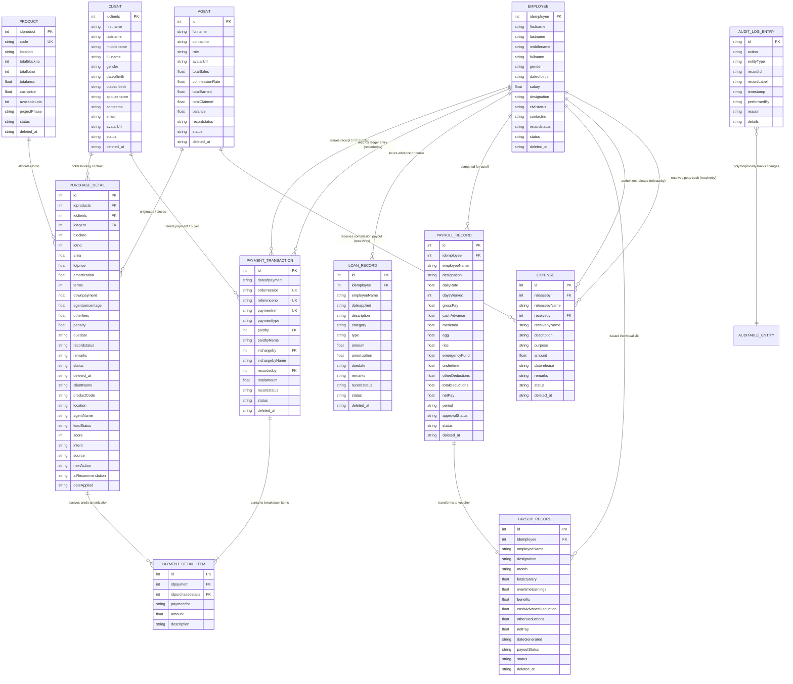

# JLD Subdivision - Enterprise Database Architecture & Entity Relationship Diagram (ERD)

> **Document Version**: 2.4.0  
> **System Scope**: JLD Subdivision Real Estate ERP & Accounting Management Workspace  
> **Source Baseline**: `src/types/index.ts`, `src/data/initialData.ts`, `src/utils/guardRails.ts`, `src/utils/workflows.ts`, `src/utils/calculations.ts`  
> **Architecture Pattern**: Normalized Relational Enterprise Ledger (Double-Entry Aligned, Soft-Delete Preserved, Audit-Led)

---

## 1. Executive Summary & Architecture Overview

The **JLD Subdivision Real Estate & Accounting Management Workspace** is designed around a fully interconnected relational data model handling subdivision inventory, buyer contracts, payment collections, broker commissions, workforce compensation, operating disbursements, and an immutable compliance audit trail.

### Key Data Architecture Domains

1. **Property & Inventory Domain**: Manages subdivision projects, blocks, and lot parcels (`Product`).
2. **CRM & Buyer Domain**: Manages client profiles, contact points, and stakeholder records (`Client`).
3. **Sales Contract & Allocation Domain**: Connects lots, clients, and brokers into legally binding amortized purchase contracts with CRM scoring (`PurchaseDetail`).
4. **Revenue & Collections Domain**: Dual-layer ledger with Official Receipt headers (`PaymentTransaction`) and multi-item line item allocation (`PaymentDetailItem`).
5. **Brokerage & Agency Domain**: Manages real estate agents, commission rates, and real-time accrued balance tracking (`Agent`).
6. **Workforce & Payroll Domain**: Manages employee profiles (`Employee`), loans/cash advances/allowances (`LoanRecord`), periodic payroll cutoff computation (`PayrollRecord`), and distributed payslips (`PayslipRecord`).
7. **Disbursements & Cash Flow Domain**: Tracks certified financial disbursements, petty cash, and agent commission payouts (`Expense`).
8. **Compliance & Audit Domain**: Immutable audit trail logging all lifecycle actions across all system tables (`AuditLogEntry`).
9. **Dynamic Reporting Projections**: Real-time synthesized financial statement views (`SOAStatement`).

---

## 2. Master Entity Relationship Diagram (Mermaid ERD)



---

## 3. Data Dictionary & Field Specifications

### 3.1. Entity: `Product` (Subdivision Projects & Lots Inventory)
- **Primary Key**: `idproduct` (Integer)
- **Unique Identifier**: `code` (String)
- **Codebase Source**: `src/types/index.ts:20` | `src/data/initialData.ts:3`
- **Description**: Represents a planned subdivision project or phase comprising blocks and individual lots available for acquisition.

| Field Name | Type | Nullable | Key | Constraints / Enum | Description |
| :--- | :--- | :---: | :---: | :--- | :--- |
| `idproduct` | INTEGER | NO | **PK** | Auto-increment / Sequential | Unique subdivision identifier |
| `code` | VARCHAR(50) | NO | **UK** | e.g., 'JLD-STN', 'JLD-NOR1' | Project phase identification code |
| `location` | VARCHAR(255) | NO | - | - | Physical geographic address / municipality |
| `totalblockno` | INTEGER | NO | - | > 0 | Total planned blocks in subdivision |
| `totallotno` | INTEGER | NO | - | > 0 | Total number of subdivided lots |
| `totalarea` | DECIMAL(12,2) | NO | - | In square meters (sqm) | Total land title landmass area |
| `cashprice` | DECIMAL(12,2) | NO | - | Currency (PHP) | Base benchmark cash valuation |
| `availableLots`| INTEGER | YES | - | Default 0 | Remaining unsold inventory count |
| `projectPhase` | VARCHAR(30) | YES | - | `'Open'`, `'Nearly Sold'`, `'Completed'` | Development / sales velocity status |
| `status` | VARCHAR(20) | NO | - | `'active'`, `'archived'` | Soft-delete entity flag |
| `deleted_at` | TIMESTAMP | YES | - | ISO-8601 UTC | Timestamp of archival or deletion |

---

### 3.2. Entity: `Client` (Buyers & Stakeholders Directory)
- **Primary Key**: `idclients` (Integer)
- **Codebase Source**: `src/types/index.ts:3` | `src/data/initialData.ts:140`
- **Description**: Master customer and stakeholder record storing identity, demographic data, and contact coordinates.

| Field Name | Type | Nullable | Key | Constraints / Enum | Description |
| :--- | :--- | :---: | :---: | :--- | :--- |
| `idclients` | INTEGER | NO | **PK** | Auto-increment / Sequential | Unique buyer / stakeholder ID |
| `firstname` | VARCHAR(100) | NO | - | - | Buyer given first name |
| `lastname` | VARCHAR(100) | NO | - | - | Buyer family surname |
| `middlename` | VARCHAR(100) | YES | - | - | Buyer middle name |
| `fullname` | VARCHAR(255) | NO | - | Computed or explicit string | Formatted full legal name |
| `gender` | VARCHAR(20) | YES | - | 'Male', 'Female', etc. | Demographic gender |
| `dateofbirth` | DATE | YES | - | YYYY-MM-DD | Date of birth |
| `placeofbirth`| VARCHAR(255) | YES | - | - | Legal place of birth |
| `spousename` | VARCHAR(255) | YES | - | - | Legal spouse name |
| `contactno` | VARCHAR(50) | NO | - | Mobile / telephone | Primary contact telephone number |
| `email` | VARCHAR(150) | YES | - | Valid email address | Digital notification address |
| `avatarUrl` | VARCHAR(500) | YES | - | URL string | Profile image avatar |
| `status` | VARCHAR(20) | NO | - | `'active'`, `'archived'` | Soft-delete entity status |
| `deleted_at` | TIMESTAMP | YES | - | ISO-8601 UTC | Archival timestamp |

---

### 3.3. Entity: `Agent` (Licensed Brokers & Sales Specialists)
- **Primary Key**: `id` (Integer)
- **Codebase Source**: `src/types/index.ts:108` | `src/data/initialData.ts:71`
- **Description**: Real estate sales agent and brokerage registry tracking sales performance, commission rates, claims, and remaining accrued balance.

| Field Name | Type | Nullable | Key | Constraints / Enum | Description |
| :--- | :--- | :---: | :---: | :--- | :--- |
| `id` | INTEGER | NO | **PK** | Auto-increment / Sequential | Unique sales agent ID |
| `fullname` | VARCHAR(255) | NO | - | - | Full legal broker name |
| `contactno` | VARCHAR(50) | NO | - | - | Mobile contact number |
| `role` | VARCHAR(50) | NO | - | 'Senior Broker', 'Sales Director', 'Area Dicer', 'Area Dicer Manager', 'Property Specialist' | Commission title and organizational role |
| `avatarUrl` | VARCHAR(500) | YES | - | URL string | Agent headshot |
| `totalSales` | DECIMAL(14,2) | NO | - | Default 0.00 | Total contracted sales value generated |
| `commissionRate`| DECIMAL(5,2)| NO | - | 0.00 to 100.00 (e.g. 7.00, 10.00) | Default broker commission percentage |
| `totalEarned` | DECIMAL(14,2) | NO | - | Accrued from collections | Cumulative commission earned |
| `totalClaimed`| DECIMAL(14,2) | NO | - | From Expense vouchers | Cumulative commission paid out |
| `balance` | DECIMAL(14,2) | NO | - | `totalEarned - totalClaimed` | Unclaimed liquid commission balance |
| `recordstatus`| VARCHAR(30) | NO | - | 'active', 'inactive' | Operational status |
| `status` | VARCHAR(20) | NO | - | `'active'`, `'archived'` | Soft-delete entity flag |
| `deleted_at` | TIMESTAMP | YES | - | ISO-8601 UTC | Archival timestamp |

---

### 3.4. Entity: `PurchaseDetail` (Binding Lot Contracts & CRM Pipeline)
- **Primary Key**: `id` (Integer)
- **Foreign Keys**:
  - `idproducts` → `Product(idproduct)`
  - `idclients` → `Client(idclients)`
  - `idagent` → `Agent(id)`
- **Codebase Source**: `src/types/index.ts:37` | `src/data/initialData.ts:250`
- **Description**: The core transactional contract binding a buyer (`Client`) to a subdivision lot (`Product`), brokered by an `Agent`. Contains financial terms, amortizations, penalties, and SaaS CRM pipeline scoring.

| Field Name | Type | Nullable | Key | Constraints / Enum | Description |
| :--- | :--- | :---: | :---: | :--- | :--- |
| `id` | INTEGER | NO | **PK** | Auto-increment / Sequential | Contract / purchase record ID |
| `idproducts` | INTEGER | NO | **FK** | Ref `Product.idproduct` | Associated subdivision project |
| `idclients` | INTEGER | NO | **FK** | Ref `Client.idclients` | Purchasing client / buyer |
| `idagent` | INTEGER | NO | **FK** | Ref `Agent.id` | Closing broker / agent |
| `blockno` | INTEGER | NO | - | Block number in phase | Subdivision Block number |
| `lotno` | INTEGER | NO | - | Lot number in block | Subdivision Lot number |
| `area` | DECIMAL(10,2) | NO | - | Square meters | Contracted parcel lot area |
| `lotprice` | DECIMAL(12,2) | NO | - | Currency (PHP) | Total contracted selling price |
| `amortization` | DECIMAL(12,2) | NO | - | Currency (PHP) | Monthly amortization installment |
| `terms` | INTEGER | NO | - | In years (e.g. 1, 3, 5) | Payment installment duration |
| `downpayment` | DECIMAL(12,2) | NO | - | Currency (PHP) | Required initial downpayment |
| `agentpercentage`| DECIMAL(5,2)| NO | - | Contract commission rate (%) | Broker commission cut for this deal |
| `otherfees` | DECIMAL(12,2) | NO | - | Transfer / legal fees | Additional contract fees |
| `penalty` | DECIMAL(12,2) | NO | - | Default 0.00 | Accumulated default / late penalty |
| `duedate` | DATE | NO | - | YYYY-MM-DD | Monthly recurring amortization due date |
| `recordstatus`| VARCHAR(30) | NO | - | 'Active', 'Settled', 'Default' | Operational ledger status |
| `remarks` | TEXT | YES | - | - | Internal administrative notes |
| `status` | VARCHAR(20) | NO | - | `'active'`, `'archived'` | Soft-delete entity flag |
| `deleted_at` | TIMESTAMP | YES | - | ISO-8601 UTC | Archival timestamp |
| `clientName` | VARCHAR(255) | NO | - | Denormalized display cache | Buyer formatted full name |
| `productCode` | VARCHAR(50) | NO | - | Denormalized display cache | Subdivision code (e.g., 'JLD-STN') |
| `location` | VARCHAR(255) | NO | - | Denormalized display cache | Subdivision location |
| `agentName` | VARCHAR(255) | NO | - | Denormalized display cache | Broker name |
| `leadStatus` | VARCHAR(30) | YES | - | 'New', 'Demo Scheduled', 'Negotiation', 'Proposal Sent', 'Contacted', 'Qualified', 'Active', 'Overdue', 'Fully Paid' | CRM pipeline lifecycle status |
| `score` | INTEGER | NO | - | Range 0 to 100 | AI / algorithmic conversion score |
| `intent` | VARCHAR(20) | NO | - | 'High', 'Medium', 'Low' | Buyer purchase readiness intent |
| `source` | VARCHAR(50) | NO | - | 'Direct Client', 'Google Ads', 'Referral', 'Site Visit', 'Facebook' | Lead generation channel |
| `nextAction` | VARCHAR(255) | YES | - | - | Scheduled operational follow-up |
| `aiRecommendation`| VARCHAR(255)| YES| - | - | Smart operational advisory note |
| `dateApplied` | DATE | NO | - | YYYY-MM-DD | Contract application date |

---

### 3.5. Entity: `PaymentTransaction` (Official Receipt Collections Header)
- **Primary Key**: `id` (Integer)
- **Unique Identifiers**: `orderreceipt` (OR Number), `referenceno`, `paymentref`
- **Foreign Keys**:
  - `paidby` → `Client(idclients)`
  - `inchargeby` → `Employee(idemployee)`
  - `recordedby` → `Employee(idemployee)`
- **Codebase Source**: `src/types/index.ts:89` | `src/data/initialData.ts:380`
- **Description**: Legal financial document header capturing buyer payments, issuing staff, payment method, and total certified collection.

| Field Name | Type | Nullable | Key | Constraints / Enum | Description |
| :--- | :--- | :---: | :---: | :--- | :--- |
| `id` | INTEGER | NO | **PK** | Auto-increment / Sequential | Transaction ledger ID |
| `dateofpayment`| DATE | NO | - | YYYY-MM-DD | Official payment date |
| `orderreceipt` | VARCHAR(50) | NO | **UK** | e.g., 'OR-88219' | Official Receipt (OR) Number |
| `referenceno` | VARCHAR(50) | NO | **UK** | Bank / check / reference no | External transaction reference |
| `paymentref` | VARCHAR(50) | NO | **UK** | e.g., 'PR-2026-001' | Internal unique voucher reference |
| `paymenttype` | VARCHAR(30) | NO | - | `'CASH'`, `'CHEQUE'`, `'BANK TRANSFER'`, `'GCASH'`, `'MAYA'` | Remittance payment instrument |
| `paidby` | INTEGER | NO | **FK** | Ref `Client.idclients` | Paying buyer / client ID |
| `paidbyName` | VARCHAR(255) | NO | - | Denormalized display cache | Payer full name |
| `inchargeby` | INTEGER | NO | **FK** | Ref `Employee.idemployee` | Collector / Area In-Charge staff ID |
| `inchargebyName`| VARCHAR(255)| NO | - | Denormalized display cache | Collector staff name |
| `recordedby` | INTEGER | NO | **FK** | Ref `Employee.idemployee` | Cashier / Bookkeeper staff ID |
| `totalamount` | DECIMAL(12,2) | NO | - | Sum of line items (`items`) | Certified total collection amount |
| `recordstatus`| VARCHAR(30) | NO | - | 'valid', 'cancelled' | Transaction validity state |
| `status` | VARCHAR(20) | NO | - | `'active'`, `'archived'` | Soft-delete entity flag |
| `deleted_at` | TIMESTAMP | YES | - | ISO-8601 UTC | Archival timestamp |

---

### 3.6. Entity: `PaymentDetailItem` (Receipt Line Item Allocation)
- **Primary Key**: `id` (Integer)
- **Foreign Keys**:
  - `idpayment` → `PaymentTransaction(id)`
  - `idpurchasedetails` → `PurchaseDetail(id)`
- **Codebase Source**: `src/types/index.ts:80`
- **Description**: Granular breakdown item allocating portions of an Official Receipt to specific contracts and balance buckets (downpayment, monthly installment, or reservation fee).

| Field Name | Type | Nullable | Key | Constraints / Enum | Description |
| :--- | :--- | :---: | :---: | :--- | :--- |
| `id` | INTEGER | NO | **PK** | Auto-increment / Sequential | Line item ID |
| `idpayment` | INTEGER | NO | **FK** | Ref `PaymentTransaction.id` | Parent collection receipt |
| `idpurchasedetails`| INTEGER | NO | **FK** | Ref `PurchaseDetail.id` | Target sales contract lot |
| `paymentfor` | VARCHAR(30) | NO | - | `'RESERVED'`, `'DOWN PAYMENT'`, `'INSTALLMENT'`, `'FULL PAYMENT'` | Allocation fee classification |
| `amount` | DECIMAL(12,2) | NO | - | > 0.00 | Allocated monetary amount |
| `description` | VARCHAR(255) | YES | - | - | Line item narrative note |

---

### 3.7. Entity: `Employee` (Staff & Payroll Directory)
- **Primary Key**: `idemployee` (Integer)
- **Codebase Source**: `src/types/index.ts:152` | `src/data/initialData.ts:500`
- **Description**: Personnel master list representing operational officers, collectors, cashiers, and administrative staff.

| Field Name | Type | Nullable | Key | Constraints / Enum | Description |
| :--- | :--- | :---: | :---: | :--- | :--- |
| `idemployee` | INTEGER | NO | **PK** | Auto-increment / Sequential | Employee identification number |
| `firstname` | VARCHAR(100) | NO | - | - | Employee given name |
| `lastname` | VARCHAR(100) | NO | - | - | Employee surname |
| `middlename` | VARCHAR(100) | YES | - | - | Employee middle name |
| `fullname` | VARCHAR(255) | NO | - | Formatted name | Full formal name |
| `gender` | VARCHAR(20) | YES | - | 'Male', 'Female', etc. | Gender |
| `dateofbirth` | DATE | YES | - | YYYY-MM-DD | Birthdate |
| `salary` | DECIMAL(10,2) | NO | - | Currency (PHP) | Daily wage rate (base compensation) |
| `designation` | VARCHAR(100) | NO | - | e.g. 'Collector', 'Accountant' | Corporate position / title |
| `civilstatus` | VARCHAR(30) | YES | - | 'Single', 'Married', etc. | Civil status |
| `contactno` | VARCHAR(50) | NO | - | - | Contact phone number |
| `recordstatus`| VARCHAR(30) | NO | - | 'active', 'resigned' | Employment status |
| `status` | VARCHAR(20) | NO | - | `'active'`, `'archived'` | Soft-delete entity flag |
| `deleted_at` | TIMESTAMP | YES | - | ISO-8601 UTC | Archival timestamp |

---

### 3.8. Entity: `LoanRecord` (Cash Advances, Loans & Allowances)
- **Primary Key**: `id` (Integer)
- **Foreign Key**: `idemployee` → `Employee(idemployee)`
- **Codebase Source**: `src/types/index.ts:169` | `src/data/initialData.ts:650`
- **Description**: Financial ledger of staff cash advances, salary loans, allowances, bonuses, and incentives that feed directly into payroll computation.

| Field Name | Type | Nullable | Key | Constraints / Enum | Description |
| :--- | :--- | :---: | :---: | :--- | :--- |
| `id` | INTEGER | NO | **PK** | Auto-increment / Sequential | Loan / adjustment record ID |
| `idemployee` | INTEGER | NO | **FK** | Ref `Employee.idemployee` | Target employee recipient |
| `employeeName`| VARCHAR(255)| NO | - | Denormalized display cache | Employee full name |
| `dateapplied` | DATE | NO | - | YYYY-MM-DD | Date applied / issued |
| `description` | VARCHAR(255) | NO | - | - | Reason / voucher note |
| `category` | VARCHAR(50) | NO | - | `'CASH ADVANCE'`, `'SALARY LOAN'`, `'EMERGENCY LOAN'`, `'ALLOWANCE'`, `'BONUS'`, `'COMMISSION INCENTIVE'` | Classification category |
| `type` | VARCHAR(20) | NO | - | `'DEDUCTION'`, `'EARNING'` | Payroll effect classification |
| `amount` | DECIMAL(10,2) | NO | - | Total principal / adjustment | Remaining loan balance or bonus sum |
| `amortization` | DECIMAL(10,2) | NO | - | Deducted per cutoff | Periodic cutoff deduction amount |
| `duedate` | DATE | YES | - | YYYY-MM-DD | Maturity / settlement due date |
| `remarks` | TEXT | YES | - | - | Management remarks |
| `recordstatus`| VARCHAR(30) | NO | - | 'Active', 'Settled' | Fulfillment status |
| `status` | VARCHAR(20) | NO | - | `'active'`, `'archived'` | Soft-delete entity flag |
| `deleted_at` | TIMESTAMP | YES | - | ISO-8601 UTC | Archival timestamp |

---

### 3.9. Entity: `PayrollRecord` (Cutoff Payroll Batch Computation)
- **Primary Key**: `id` (Integer)
- **Foreign Key**: `idemployee` → `Employee(idemployee)`
- **Codebase Source**: `src/types/index.ts:204` | `src/utils/workflows.ts:3`
- **Description**: Periodic payroll batch record containing gross pay, detailed deductions, and final net pay for a specific cutoff window.

| Field Name | Type | Nullable | Key | Constraints / Enum | Description |
| :--- | :--- | :---: | :---: | :--- | :--- |
| `id` | INTEGER | NO | **PK** | Epoch timestamp + index | Payroll calculation ID |
| `idemployee` | INTEGER | NO | **FK** | Ref `Employee.idemployee` | Target employee |
| `employeeName`| VARCHAR(255)| NO | - | Denormalized display cache | Employee name |
| `designation` | VARCHAR(100) | NO | - | - | Job title |
| `dailyRate` | DECIMAL(10,2) | NO | - | Base `Employee.salary` | Daily compensation rate |
| `daysWorked` | INTEGER | NO | - | 1 to 31 | Working days rendered in period |
| `grossPay` | DECIMAL(10,2) | NO | - | `(dailyRate * days) + earnings` | Total gross wages |
| `cashAdvance` | DECIMAL(10,2) | NO | - | Auto-deducted from loans | Cash advance amortizations |
| `merienda` | DECIMAL(10,2) | NO | - | Default 0.00 | Snack / meal deduction |
| `egg` | DECIMAL(10,2) | NO | - | Default 0.00 | Provisions deduction |
| `rice` | DECIMAL(10,2) | NO | - | Default 0.00 | Rice subsidy deduction |
| `emergencyFund`| DECIMAL(10,2)| NO | - | Default 0.00 | Emergency savings contribution |
| `undertime` | DECIMAL(10,2) | NO | - | Default 0.00 | Late / undertime deduction |
| `otherDeductions`| DECIMAL(10,2)| NO| - | Default 0.00 | Miscellaneous deductions |
| `totalDeductions`| DECIMAL(10,2)| NO| - | Sum of all deductions | Aggregate wage deductions |
| `netPay` | DECIMAL(10,2) | NO | - | `grossPay - totalDeductions` | Net take-home pay |
| `period` | VARCHAR(50) | NO | - | e.g., '2026-09-01 – 2026-09-15' | Inclusive payroll cutoff dates |
| `approvalStatus`| VARCHAR(30) | NO | - | `'Pending'`, `'Approved'` | Management sign-off state |
| `status` | VARCHAR(20) | NO | - | `'active'`, `'archived'` | Soft-delete entity flag |
| `deleted_at` | TIMESTAMP | YES | - | ISO-8601 UTC | Archival timestamp |

---

### 3.10. Entity: `PayslipRecord` (Printable Employee Salary Vouchers)
- **Primary Key**: `id` (Integer, matches `PayrollRecord.id`)
- **Foreign Key**: `idemployee` → `Employee(idemployee)`
- **Codebase Source**: `src/types/index.ts:186` | `src/utils/workflows.ts:18`
- **Description**: Certified salary slip voucher issued to individual employees reflecting earnings, itemized deductions, and disbursement state.

| Field Name | Type | Nullable | Key | Constraints / Enum | Description |
| :--- | :--- | :---: | :---: | :--- | :--- |
| `id` | INTEGER | NO | **PK** | Aligns with `PayrollRecord.id` | Unique payslip voucher ID |
| `idemployee` | INTEGER | NO | **FK** | Ref `Employee.idemployee` | Recipient employee |
| `employeeName`| VARCHAR(255)| NO | - | - | Employee name |
| `designation` | VARCHAR(100) | NO | - | - | Job position |
| `month` | VARCHAR(50) | NO | - | Period string | Cutoff billing month / range |
| `basicSalary` | DECIMAL(10,2) | NO | - | `dailyRate * daysWorked` | Basic earnings |
| `overtimeEarnings`| DECIMAL(10,2)| NO| - | Overtime pay | Additional OT earnings |
| `benefits` | DECIMAL(10,2) | NO | - | Non-taxable benefits / bonus | Period benefits included |
| `cashAdvanceDeduction`| DECIMAL(10,2)| NO| - | Loan repayment | Total advance recovery |
| `otherDeductions`| DECIMAL(10,2)| NO| - | Sundry deductions | Total other deductions |
| `netPay` | DECIMAL(10,2) | NO | - | Take-home compensation | Total payable cash/transfer |
| `dateGenerated`| DATE | NO | - | YYYY-MM-DD | Slip issuance date |
| `payoutStatus` | VARCHAR(30) | NO | - | `'Draft'`, `'Released'`, `'Paid'` | Cash payout progression |
| `status` | VARCHAR(20) | NO | - | `'active'`, `'archived'` | Soft-delete entity flag |
| `deleted_at` | TIMESTAMP | YES | - | ISO-8601 UTC | Archival timestamp |

---

### 3.11. Entity: `Expense` (Cash Disbursement & Commission Payout Vouchers)
- **Primary Key**: `id` (Integer)
- **Foreign Keys**:
  - `releaseby` → `Employee(idemployee)`
  - `receiveby` → Polymorphic: `Employee(idemployee)` OR `Agent(id)`
- **Codebase Source**: `src/types/index.ts:124` | `src/data/initialData.ts:800`
- **Description**: Certified financial outflow ledger tracking petty cash expenses, supplies, legal fees, and broker commission disbursements.

| Field Name | Type | Nullable | Key | Constraints / Enum | Description |
| :--- | :--- | :---: | :---: | :--- | :--- |
| `id` | INTEGER | NO | **PK** | Auto-increment / Sequential | Disbursement voucher ID |
| `releaseby` | INTEGER | NO | **FK** | Ref `Employee.idemployee` | Disbursing accounting officer |
| `releasebyName`| VARCHAR(255)| NO| - | - | Disbursing officer name |
| `receiveby` | INTEGER | NO | **FK** | Ref `Employee.idemployee` or `Agent.id` | Payee recipient ID |
| `receivebyName`| VARCHAR(255)| NO| - | - | Payee recipient name |
| `description` | VARCHAR(255) | NO | - | - | Outflow narrative / memo |
| `purpose` | VARCHAR(100) | NO | - | e.g. 'Agent commission', 'Office supplies', 'Travel' | Accounting classification |
| `amount` | DECIMAL(12,2) | NO | - | > 0.00 | Disbursed monetary amount |
| `daterelease` | DATE | NO | - | YYYY-MM-DD | Disbursement date |
| `remarks` | TEXT | YES | - | - | Additional voucher details |
| `status` | VARCHAR(20) | NO | - | `'active'`, `'archived'` | Soft-delete entity flag |
| `deleted_at` | TIMESTAMP | YES | - | ISO-8601 UTC | Archival timestamp |

---

### 3.12. Entity: `AuditLogEntry` (System Audit Trail & Compliance Ledger)
- **Primary Key**: `id` (String UUID)
- **Polymorphic Reference**: `entityType` + `recordId`
- **Codebase Source**: `src/types/index.ts:243` | `src/data/initialData.ts:1000`
- **Description**: Immutable append-only operational audit log tracking creations, edits, soft-deletes (archiving), restorations, and permanent deletion attempts.

| Field Name | Type | Nullable | Key | Constraints / Enum | Description |
| :--- | :--- | :---: | :---: | :--- | :--- |
| `id` | VARCHAR(50) | NO | **PK** | UUID / ISO timestamp string | Unique audit entry identifier |
| `action` | VARCHAR(30) | NO | - | `'CREATE'`, `'EDIT'`, `'ARCHIVE'`, `'RESTORE'`, `'PERMANENT_DELETE'` | Lifecycle operation |
| `entityType` | VARCHAR(30) | NO | - | `'Product'`, `'Stakeholder'`, `'Purchase'`, `'Payment'`, `'Agent'`, `'Employee'`, `'Loan'`, `'Benefit'`, `'Payroll'`, `'Payslip'`, `'Expense'`, `'SOA'` | Target entity table |
| `recordId` | VARCHAR(50) | NO | - | Polymorphic ID | Foreign record identifier |
| `recordLabel` | VARCHAR(255) | NO | - | - | Human-readable record name / title |
| `timestamp` | TIMESTAMP | NO | - | ISO-8601 UTC | Operation execution time |
| `performedBy` | VARCHAR(100) | NO | - | Email / User ID | Authenticated user identity |
| `reason` | VARCHAR(255) | YES | - | - | Operator rationale / explanation |
| `details` | TEXT | YES | - | JSON / key-value diff | Detailed state mutation payload |

---

### 3.13. Dynamic Projection / Composite View: `SOAStatement`
- **Composite Key**: `client.idclients` + `purchase.id`
- **Codebase Source**: `src/types/index.ts:139` | `src/utils/calculations.ts`
- **Description**: Dynamically computed real-time Statement of Account (SOA) synthesizing buyer obligations, paid installments, and remaining balances.

| Field Name | Derived From | Computation / Rule |
| :--- | :--- | :--- |
| `totalPriceWithFees`| `PurchaseDetail` | `lotprice + otherfees + penalty` |
| `totalPaid` | `PaymentDetailItem[]` | `SUM(PaymentDetailItem.amount)` where `idpurchasedetails == purchase.id` |
| `remainingBalance` | Calculation | `totalPriceWithFees - totalPaid` |
| `nextDueDate` | `PurchaseDetail.duedate` | Next calendar recurring amortization schedule |
| `accountStatus` | Calculation | `'Cleared'` if `remainingBalance <= 0`, `'Overdue'` if past due date, else `'Up to date'` |

---

## 4. Relational Integrity Matrix & Guard Rails

The system enforces strict real-world ERP accounting rules to ensure relational consistency and statutory compliance via `src/utils/guardRails.ts`:

| Parent Entity | Dependent Entity | Foreign Key Column | Cardinality | Deletion & Archival Guard Rail Rule | Codebase Enforcer |
| :--- | :--- | :--- | :---: | :--- | :--- |
| `Product` | `PurchaseDetail` | `idproducts` | 1 : N | **RESTRICT ARCHIVE**: Cannot archive product if active client purchase contracts exist. **BLOCK HARD DELETE**: Permanent deletion completely blocked if historical lot contracts exist. | `checkProductArchiveGuard`<br/>`checkPermanentDeleteIntegrity` |
| `Client` | `PurchaseDetail` | `idclients` | 1 : N | **RESTRICT ARCHIVE**: Cannot archive buyer with active contracts. **BLOCK HARD DELETE**: Permanent deletion blocked if historical contracts or payment records exist. | `checkClientArchiveGuard`<br/>`checkPermanentDeleteIntegrity` |
| `Client` | `PaymentTransaction`| `paidby` | 1 : N | **BLOCK HARD DELETE**: Financial regulations prohibit removing ledger participants. | `checkPermanentDeleteIntegrity` |
| `Agent` | `PurchaseDetail` | `idagent` | 1 : N | **RESTRICT ARCHIVE**: Cannot archive if agent has active sales contracts. **BLOCK HARD DELETE**: Blocked if historical sales exist. | `checkAgentArchiveGuard`<br/>`checkPermanentDeleteIntegrity` |
| `Agent` | `Expense` | `receiveby` | 1 : N | **RESTRICT ARCHIVE**: Cannot archive agent if unclaimed balance (`balance > 0`) exists. | `checkAgentArchiveGuard` |
| `PurchaseDetail` | `PaymentDetailItem`| `idpurchasedetails`| 1 : N | **BLOCK HARD DELETE**: Cannot permanently delete purchase contract if payments exist in ledger. | `checkPermanentDeleteIntegrity` |
| `PaymentTransaction`| `PaymentDetailItem`| `idpayment` | 1 : N (1:M) | **CASCADE SOFT-DELETE**: Archiving receipt archives child items. **BLOCK HARD DELETE**: Official receipts cannot be destroyed. | `checkPermanentDeleteIntegrity` |
| `Employee` | `PaymentTransaction`| `inchargeby`, `recordedby` | 1 : N | **BLOCK HARD DELETE**: Cannot destroy employee who issued receipts. | `checkPermanentDeleteIntegrity` |
| `Employee` | `Expense` | `releaseby`, `receiveby` | 1 : N | **BLOCK HARD DELETE**: Cannot destroy employee who authorized disbursements. | `checkPermanentDeleteIntegrity` |
| `Employee` | `LoanRecord` | `idemployee` | 1 : N | **RESTRICT ARCHIVE**: Cannot archive employee with active loans/advances. | `checkEmployeeArchiveGuard` |
| `Employee` | `PayrollRecord`| `idemployee` | 1 : N | **RESTRICT ARCHIVE**: Cannot archive employee with pending payroll calculations. | `checkEmployeeArchiveGuard` |
| `PayrollRecord` | `PayslipRecord` | `id` (1:1) | 1 : 1 | **BLOCK HARD DELETE**: Statutory labor records cannot be deleted. | `checkPermanentDeleteIntegrity` |

---

## 5. End-to-End Business Data Workflows

### 5.1. Lot Purchase & Sales Contract Lifecycle
1. Subdivision lots are defined in `Product` with inventory count (`totallotno`, `availableLots`).
2. A prospective buyer is registered in `Client`.
3. An `Agent` closes the transaction, generating a `PurchaseDetail` contract.
4. Validation ensures the selected Block & Lot are not already assigned to an active contract.
5. `Product.availableLots` is decremented.

### 5.2. Collection Processing & Commission Accrual Lifecycle
1. The buyer remits payment, captured as a `PaymentTransaction` (Official Receipt) with unique `orderreceipt`.
2. One or more `PaymentDetailItem` records break down the receipt amount (e.g. Reservation, Downpayment, Monthly Installment) credited to `PurchaseDetail.id`.
3. **Automated Commission Accrual**: The system calculates `accruedCommission = PaymentDetailItem.amount * (PurchaseDetail.agentpercentage / 100)`.
4. The assigned `Agent` has their `totalEarned` and liquid `balance` incremented.

### 5.3. Commission Payout & Cash Flow Reconciliation
1. When an agent requests commission withdrawal, an `Expense` record is generated:
   - `purpose = 'Agent commission'`
   - `receiveby = Agent.id`
   - `releaseby = Employee.idemployee` (Disbursing Officer)
2. `Agent.totalClaimed` increases by the disbursed amount, and `Agent.balance` is reduced.
3. Total Cash Flow Reporting synthesizes net liquid cash:  
   $$\text{Net Cash Position} = \sum \text{PaymentTransaction.totalamount} - \sum \text{Expense.amount}$$

### 5.4. Workforce Compensation & Payroll Cutoff Lifecycle
1. Staff profiles and daily wage rates are configured in `Employee`.
2. During the cutoff, staff take advances or earn bonuses recorded in `LoanRecord`.
3. Executing `preparePayroll(db, start, end, workingDays)`:
   - Validates that working days do not exceed elapsed days ($1 \le days \le 31$).
   - Filters active employees and sums eligible loan amortizations up to remaining loan balance.
   - Calculates $\text{Gross Pay} = (\text{salary} \times \text{days}) + \text{benefits}$.
   - Verifies deductions do not exceed gross pay.
   - Creates a `PayrollRecord` batch in `'Pending'` status.
4. Calling `payslipFromPayroll(record)` generates a synchronized 1:1 printable `PayslipRecord` voucher.

---

## 6. Production SQL DDL Schema (PostgreSQL / MySQL Compatible)

For backend migration to an enterprise relational database (such as PostgreSQL, MySQL, or Supabase), the following complete DDL schema can be deployed directly:

```sql
-- ==========================================================
-- JLD SUBDIVISION ERP - RELATIONAL DATABASE SCHEMA (DDL)
-- ==========================================================

-- ENUMS & DOMAIN TYPES
CREATE TYPE entity_status_enum AS ENUM ('active', 'archived');
CREATE TYPE project_phase_enum AS ENUM ('Open', 'Nearly Sold', 'Completed');
CREATE TYPE payment_method_enum AS ENUM ('CASH', 'CHEQUE', 'BANK TRANSFER', 'GCASH', 'MAYA');
CREATE TYPE payment_for_enum AS ENUM ('RESERVED', 'DOWN PAYMENT', 'INSTALLMENT', 'FULL PAYMENT');
CREATE TYPE loan_category_enum AS ENUM ('CASH ADVANCE', 'SALARY LOAN', 'EMERGENCY LOAN', 'ALLOWANCE', 'BONUS', 'COMMISSION INCENTIVE');
CREATE TYPE loan_type_enum AS ENUM ('DEDUCTION', 'EARNING');
CREATE TYPE approval_status_enum AS ENUM ('Pending', 'Approved');
CREATE TYPE payout_status_enum AS ENUM ('Draft', 'Released', 'Paid');
CREATE TYPE audit_action_enum AS ENUM ('CREATE', 'EDIT', 'ARCHIVE', 'RESTORE', 'PERMANENT_DELETE');

-- 1. PRODUCTS (SUBDIVISION INVENTORY)
CREATE TABLE products (
    idproduct SERIAL PRIMARY KEY,
    code VARCHAR(50) NOT NULL UNIQUE,
    location VARCHAR(255) NOT NULL,
    totalblockno INT NOT NULL CHECK (totalblockno > 0),
    totallotno INT NOT NULL CHECK (totallotno > 0),
    totalarea NUMERIC(12, 2) NOT NULL CHECK (totalarea > 0),
    cashprice NUMERIC(12, 2) NOT NULL CHECK (cashprice >= 0),
    available_lots INT NOT NULL DEFAULT 0 CHECK (available_lots >= 0),
    project_phase project_phase_enum NOT NULL DEFAULT 'Open',
    status entity_status_enum NOT NULL DEFAULT 'active',
    deleted_at TIMESTAMPTZ NULL,
    created_at TIMESTAMPTZ NOT NULL DEFAULT CURRENT_TIMESTAMP
);

-- 2. CLIENTS (BUYERS & STAKEHOLDERS)
CREATE TABLE clients (
    idclients SERIAL PRIMARY KEY,
    firstname VARCHAR(100) NOT NULL,
    lastname VARCHAR(100) NOT NULL,
    middlename VARCHAR(100) NULL,
    fullname VARCHAR(255) NOT NULL,
    gender VARCHAR(20) NULL,
    dateofbirth DATE NULL,
    placeofbirth VARCHAR(255) NULL,
    spousename VARCHAR(255) NULL,
    contactno VARCHAR(50) NOT NULL,
    email VARCHAR(150) NULL,
    avatar_url VARCHAR(500) NULL,
    status entity_status_enum NOT NULL DEFAULT 'active',
    deleted_at TIMESTAMPTZ NULL,
    created_at TIMESTAMPTZ NOT NULL DEFAULT CURRENT_TIMESTAMP
);

-- 3. AGENTS (BROKERS)
CREATE TABLE agents (
    id SERIAL PRIMARY KEY,
    fullname VARCHAR(255) NOT NULL,
    contactno VARCHAR(50) NOT NULL,
    role VARCHAR(50) NOT NULL DEFAULT 'Property Specialist',
    avatar_url VARCHAR(500) NULL,
    total_sales NUMERIC(14, 2) NOT NULL DEFAULT 0.00,
    commission_rate NUMERIC(5, 2) NOT NULL CHECK (commission_rate >= 0 AND commission_rate <= 100),
    total_earned NUMERIC(14, 2) NOT NULL DEFAULT 0.00,
    total_claimed NUMERIC(14, 2) NOT NULL DEFAULT 0.00,
    balance NUMERIC(14, 2) GENERATED ALWAYS AS (total_earned - total_claimed) STORED,
    recordstatus VARCHAR(30) NOT NULL DEFAULT 'active',
    status entity_status_enum NOT NULL DEFAULT 'active',
    deleted_at TIMESTAMPTZ NULL,
    created_at TIMESTAMPTZ NOT NULL DEFAULT CURRENT_TIMESTAMP
);

-- 4. EMPLOYEES (WORKFORCE)
CREATE TABLE employees (
    idemployee SERIAL PRIMARY KEY,
    firstname VARCHAR(100) NOT NULL,
    lastname VARCHAR(100) NOT NULL,
    middlename VARCHAR(100) NULL,
    fullname VARCHAR(255) NOT NULL,
    gender VARCHAR(20) NULL,
    dateofbirth DATE NULL,
    salary NUMERIC(10, 2) NOT NULL CHECK (salary >= 0), -- Daily rate
    designation VARCHAR(100) NOT NULL,
    civilstatus VARCHAR(30) NULL,
    contactno VARCHAR(50) NOT NULL,
    recordstatus VARCHAR(30) NOT NULL DEFAULT 'active',
    status entity_status_enum NOT NULL DEFAULT 'active',
    deleted_at TIMESTAMPTZ NULL,
    created_at TIMESTAMPTZ NOT NULL DEFAULT CURRENT_TIMESTAMP
);

-- 5. PURCHASE DETAILS (LOT CONTRACTS)
CREATE TABLE purchase_details (
    id SERIAL PRIMARY KEY,
    idproducts INT NOT NULL REFERENCES products(idproduct) ON DELETE RESTRICT,
    idclients INT NOT NULL REFERENCES clients(idclients) ON DELETE RESTRICT,
    idagent INT NOT NULL REFERENCES agents(id) ON DELETE RESTRICT,
    blockno INT NOT NULL,
    lotno INT NOT NULL,
    area NUMERIC(10, 2) NOT NULL CHECK (area > 0),
    lotprice NUMERIC(12, 2) NOT NULL CHECK (lotprice >= 0),
    amortization NUMERIC(12, 2) NOT NULL DEFAULT 0.00,
    terms INT NOT NULL CHECK (terms >= 0),
    downpayment NUMERIC(12, 2) NOT NULL DEFAULT 0.00,
    agentpercentage NUMERIC(5, 2) NOT NULL CHECK (agentpercentage >= 0 AND agentpercentage <= 100),
    otherfees NUMERIC(12, 2) NOT NULL DEFAULT 0.00,
    penalty NUMERIC(12, 2) NOT NULL DEFAULT 0.00,
    duedate DATE NOT NULL,
    remarks TEXT NULL,
    recordstatus VARCHAR(30) NOT NULL DEFAULT 'Active',
    status entity_status_enum NOT NULL DEFAULT 'active',
    deleted_at TIMESTAMPTZ NULL,
    
    -- CRM & Pipeline Metadata
    lead_status VARCHAR(30) NOT NULL DEFAULT 'Active',
    score INT NOT NULL DEFAULT 50 CHECK (score >= 0 AND score <= 100),
    intent VARCHAR(20) NOT NULL DEFAULT 'Medium',
    source VARCHAR(50) NOT NULL DEFAULT 'Direct Client',
    next_action VARCHAR(255) NULL,
    ai_recommendation VARCHAR(255) NULL,
    date_applied DATE NOT NULL DEFAULT CURRENT_DATE,
    created_at TIMESTAMPTZ NOT NULL DEFAULT CURRENT_TIMESTAMP,

    CONSTRAINT uq_product_block_lot UNIQUE (idproducts, blockno, lotno)
);

-- 6. PAYMENT TRANSACTIONS (RECEIPT HEADERS)
CREATE TABLE payment_transactions (
    id SERIAL PRIMARY KEY,
    dateofpayment DATE NOT NULL,
    orderreceipt VARCHAR(50) NOT NULL UNIQUE,
    referenceno VARCHAR(50) NOT NULL UNIQUE,
    paymentref VARCHAR(50) NOT NULL UNIQUE,
    paymenttype payment_method_enum NOT NULL,
    paidby INT NOT NULL REFERENCES clients(idclients) ON DELETE RESTRICT,
    inchargeby INT NOT NULL REFERENCES employees(idemployee) ON DELETE RESTRICT,
    recordedby INT NOT NULL REFERENCES employees(idemployee) ON DELETE RESTRICT,
    totalamount NUMERIC(12, 2) NOT NULL CHECK (totalamount >= 0),
    recordstatus VARCHAR(30) NOT NULL DEFAULT 'valid',
    status entity_status_enum NOT NULL DEFAULT 'active',
    deleted_at TIMESTAMPTZ NULL,
    created_at TIMESTAMPTZ NOT NULL DEFAULT CURRENT_TIMESTAMP
);

-- 7. PAYMENT DETAIL ITEMS (BREAKDOWN LINES)
CREATE TABLE payment_detail_items (
    id SERIAL PRIMARY KEY,
    idpayment INT NOT NULL REFERENCES payment_transactions(id) ON DELETE CASCADE,
    idpurchasedetails INT NOT NULL REFERENCES purchase_details(id) ON DELETE RESTRICT,
    paymentfor payment_for_enum NOT NULL,
    amount NUMERIC(12, 2) NOT NULL CHECK (amount > 0),
    description VARCHAR(255) NULL,
    created_at TIMESTAMPTZ NOT NULL DEFAULT CURRENT_TIMESTAMP
);

-- 8. LOANS & ADJUSTMENTS
CREATE TABLE loan_records (
    id SERIAL PRIMARY KEY,
    idemployee INT NOT NULL REFERENCES employees(idemployee) ON DELETE RESTRICT,
    dateapplied DATE NOT NULL,
    description VARCHAR(255) NOT NULL,
    category loan_category_enum NOT NULL,
    type loan_type_enum NOT NULL,
    amount NUMERIC(10, 2) NOT NULL CHECK (amount >= 0),
    amortization NUMERIC(10, 2) NOT NULL DEFAULT 0.00,
    duedate DATE NULL,
    remarks TEXT NULL,
    recordstatus VARCHAR(30) NOT NULL DEFAULT 'Active',
    status entity_status_enum NOT NULL DEFAULT 'active',
    deleted_at TIMESTAMPTZ NULL,
    created_at TIMESTAMPTZ NOT NULL DEFAULT CURRENT_TIMESTAMP
);

-- 9. PAYROLL RECORDS (PERIOD BATCH)
CREATE TABLE payroll_records (
    id BIGINT PRIMARY KEY,
    idemployee INT NOT NULL REFERENCES employees(idemployee) ON DELETE RESTRICT,
    daily_rate NUMERIC(10, 2) NOT NULL,
    days_worked INT NOT NULL CHECK (days_worked >= 1 AND days_worked <= 31),
    gross_pay NUMERIC(10, 2) NOT NULL,
    cash_advance NUMERIC(10, 2) NOT NULL DEFAULT 0.00,
    merienda NUMERIC(10, 2) NOT NULL DEFAULT 0.00,
    egg NUMERIC(10, 2) NOT NULL DEFAULT 0.00,
    rice NUMERIC(10, 2) NOT NULL DEFAULT 0.00,
    emergency_fund NUMERIC(10, 2) NOT NULL DEFAULT 0.00,
    undertime NUMERIC(10, 2) NOT NULL DEFAULT 0.00,
    other_deductions NUMERIC(10, 2) NOT NULL DEFAULT 0.00,
    total_deductions NUMERIC(10, 2) NOT NULL DEFAULT 0.00,
    net_pay NUMERIC(10, 2) NOT NULL,
    period VARCHAR(50) NOT NULL,
    approval_status approval_status_enum NOT NULL DEFAULT 'Pending',
    status entity_status_enum NOT NULL DEFAULT 'active',
    deleted_at TIMESTAMPTZ NULL,
    created_at TIMESTAMPTZ NOT NULL DEFAULT CURRENT_TIMESTAMP,

    CONSTRAINT uq_employee_period UNIQUE (idemployee, period)
);

-- 10. PAYSLIP RECORDS (VOUCHERS)
CREATE TABLE payslip_records (
    id BIGINT PRIMARY KEY REFERENCES payroll_records(id) ON DELETE RESTRICT,
    idemployee INT NOT NULL REFERENCES employees(idemployee) ON DELETE RESTRICT,
    month VARCHAR(50) NOT NULL,
    basic_salary NUMERIC(10, 2) NOT NULL,
    overtime_earnings NUMERIC(10, 2) NOT NULL DEFAULT 0.00,
    benefits NUMERIC(10, 2) NOT NULL DEFAULT 0.00,
    cash_advance_deduction NUMERIC(10, 2) NOT NULL DEFAULT 0.00,
    other_deductions NUMERIC(10, 2) NOT NULL DEFAULT 0.00,
    net_pay NUMERIC(10, 2) NOT NULL,
    date_generated DATE NOT NULL DEFAULT CURRENT_DATE,
    payout_status payout_status_enum NOT NULL DEFAULT 'Draft',
    status entity_status_enum NOT NULL DEFAULT 'active',
    deleted_at TIMESTAMPTZ NULL,
    created_at TIMESTAMPTZ NOT NULL DEFAULT CURRENT_TIMESTAMP
);

-- 11. EXPENSES (DISBURSEMENTS & COMMISSION PAYOUTS)
CREATE TABLE expenses (
    id SERIAL PRIMARY KEY,
    releaseby INT NOT NULL REFERENCES employees(idemployee) ON DELETE RESTRICT,
    receiveby INT NOT NULL, -- Polymorphic reference to employee or agent
    description VARCHAR(255) NOT NULL,
    purpose VARCHAR(100) NOT NULL,
    amount NUMERIC(12, 2) NOT NULL CHECK (amount > 0),
    daterelease DATE NOT NULL,
    remarks TEXT NULL,
    status entity_status_enum NOT NULL DEFAULT 'active',
    deleted_at TIMESTAMPTZ NULL,
    created_at TIMESTAMPTZ NOT NULL DEFAULT CURRENT_TIMESTAMP
);

-- 12. AUDIT LOG (IMMUTABLE COMPLIANCE LEDGER)
CREATE TABLE audit_logs (
    id VARCHAR(50) PRIMARY KEY,
    action audit_action_enum NOT NULL,
    entity_type VARCHAR(30) NOT NULL,
    record_id VARCHAR(50) NOT NULL,
    record_label VARCHAR(255) NOT NULL,
    timestamp TIMESTAMPTZ NOT NULL DEFAULT CURRENT_TIMESTAMP,
    performed_by VARCHAR(100) NOT NULL,
    reason VARCHAR(255) NULL,
    details TEXT NULL
);

-- PERFORMANCE INDEXES
CREATE INDEX idx_purchases_client ON purchase_details(idclients);
CREATE INDEX idx_purchases_product ON purchase_details(idproducts);
CREATE INDEX idx_purchases_agent ON purchase_details(idagent);
CREATE INDEX idx_payments_paidby ON payment_transactions(paidby);
CREATE INDEX idx_payments_date ON payment_transactions(dateofpayment);
CREATE INDEX idx_payment_items_purchase ON payment_detail_items(idpurchasedetails);
CREATE INDEX idx_loans_employee ON loan_records(idemployee);
CREATE INDEX idx_payroll_period ON payroll_records(period);
CREATE INDEX idx_expenses_daterelease ON expenses(daterelease);
CREATE INDEX idx_audit_entity ON audit_logs(entity_type, record_id);
```

---

## 7. Verification & Implementation Notes

- **Archival Integrity**: Every entity schema implements `status` (`'active'` | `'archived'`) and `deleted_at` (timestamp) fields. Soft-deleted records are filtered out from default operational views while remaining permanently referenced in accounting ledgers and cash reports.
- **Relational Guards**: Handled by `checkProductArchiveGuard`, `checkClientArchiveGuard`, `checkAgentArchiveGuard`, `checkEmployeeArchiveGuard`, and the Super-Admin `checkPermanentDeleteIntegrity` in `src/utils/guardRails.ts`.
- **Financial Balance Rules**:
  - `Agent.balance` is always computed as `Agent.totalEarned - Agent.totalClaimed`.
  - Commission payouts create an `Expense` with `purpose = 'Agent commission'`.
  - Collections allocate line items with `PaymentDetailItem` to decrement customer balances.
