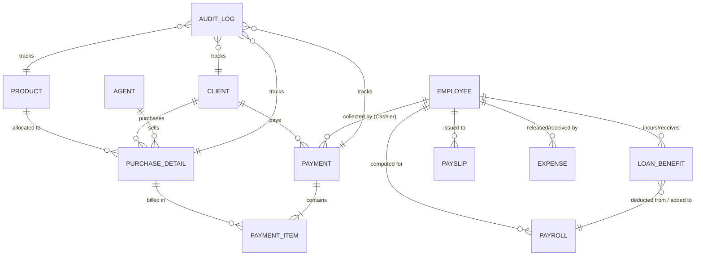

# Real Property System: Architecture, Navbar Relationships & Table Schema Guide

This document describes the complete relational architecture, database foreign keys, workflows, and business purposes of all **4 Main Navigation Modules**, their **9 Sub-Navigation Tabs**, and every table and modal inside the system.

---

## 1. High-Level System Architecture & Entity Flow



---

## 2. Comprehensive Module & Table Breakdown

The navigation is organized into **4 Core Business Modules** comprising **9 Functional Views**:

```
SIDEBAR NAVIGATION
├── [Module 1] Sales & Properties
│   ├── 1. Products (Inventory & Lots)
│   ├── 2. Stakeholders & Contracts (with Purchase Details fill-up modal)
│   └── 3. Client Payments (Official Receipts Ledger)
├── [Module 2] Agents & Commissions
│   └── 4. Unified Agent & Commission Center
├── [Module 3] HR & Payroll
│   ├── 5. Employee Directory
│   ├── 6. Loans & Benefits (Deductions vs Earnings)
│   └── 7. Payroll & Payslips (Batches & Printable Slips)
└── [Module 4] Finance & Reports
    ├── 8. Company Expenses (Disbursements)
    └── 9. Financial Reports & SOA (Cash Flow & Audit Trail)
```

---

### Module 1: Sales & Properties

#### Sub-Nav 1: Products (Inventory & Lots)
* **Component**: `InventoryTable.tsx` & `ProductModal.tsx`
* **C# Backend / Database**: `frmProducts.cs` ➔ `products` table
* **Business Purpose**:
  Serves as the root master catalog for all real estate subdivision phases and property developments managed by JLD. It defines available project inventory, block and lot divisions, lot areas, and baseline spot-cash price lists.
* **Tables & Columns Inside**:
  * `code`: Unique project phase identifier (e.g., `JLD-STN`, `JLD-NOR1`, `JLD-SUR1`, `JLD-TUP3`).
  * `location`: Project geographic location / municipality (e.g., *Sto. Niño (Tupaz)*, *Norala*).
  * `totalblockno` & `totallotno`: Total subdivision layout capacity.
  * `totalarea`: Total project phase land area in square meters.
  * `cashprice`: Base spot cash price per phase/lot.
  * `status` & `deleted_at`: Soft-delete archive preservation tags.
* **Relational Connections**:
  * **One-to-Many with `purchasedetails` (`idproducts`)**: Each product phase contains multiple client lot contracts.
  * **Archive Guard Rail**: Cannot be archived if active buyer contracts exist on any lot within the subdivision phase.

---

#### Sub-Nav 2: Stakeholders & Contracts
* **Component**: `StakeholdersTable.tsx`, `StakeholderModal.tsx`, and `PurchaseDetailsModal.tsx`
* **C# Backend / Database**: `frmClients.cs` ➔ `clients` table
* **Business Purpose**:
  Central client directory for registered property buyers and stakeholders. It maintains personal identity records, civil status, contact numbers, and spouses for legal deed titling.
* **Interactive Table Actions**:
  * **Row Click**: Opens the **Purchase Details Fill-Up Form Modal** displaying all lots owned by the buyer with full amortization schedules.
  * **`+ Apply` Button**: 1-click shortcut to launch a new lot purchase contract for this specific buyer.
  * **Edit & Archive**: Updates profile or moves client to the archived register.
* **Relational Connections**:
  * **One-to-Many with `purchasedetails` (`idclients`)**: A stakeholder can purchase 1 or multiple subdivision lots.
  * **One-to-Many with `payments` (`paidby`)**: Links all official payment receipts back to the client.
  * **Archive Guard Rail**: Cannot be archived if the stakeholder has active, unsettled lot purchase contracts.

---

#### Integrated Bridge: Purchase Details (Contract Ledger)
* **Component**: `PurchaseDetailsTable.tsx` & `ApplicationModal.tsx`
* **C# Backend / Database**: `frmApplication.cs` ➔ `purchasedetails` table
* **Business Purpose**:
  The central transaction contract that legally binds a **Buyer (`clients`)** to a specific **Subdivision Lot (`products`)** under an assigned **Sales Agent (`agent`)**. It computes downpayments, monthly amortizations at 15% p.a., financing terms (0 = Cash, 1–5 years), docs fees, penalties, and payment due dates.
* **Relational Role (3-Way Junction Entity)**:
  $$\text{Purchase Contract} = \text{Client} (\text{Buyer}) + \text{Product} (\text{Lot/Block}) + \text{Agent} (\text{Commission})$$
  * **Foreign Keys**: `idclients` ➔ `clients.idclients`, `idproducts` ➔ `products.idproduct`, `idagent` ➔ `agent.id`.
  * **Parent to `paymentdetails` (`idpurchasedetails`)**: Every installment payment receipt references this contract.

---

#### Sub-Nav 3: Client Payments (Official Receipts Ledger)
* **Component**: `PaymentsTable.tsx` & `PaymentModal.tsx`
* **C# Backend / Database**: `frmpayments.cs` ➔ `payments` & `paymentdetails` tables
* **Business Purpose**:
  Official cashier collections ledger. Records payment transactions, prints official receipts (OR #), reference numbers, payment modes (Cash, Bank Transfer, GCash, Check), and itemized distributions (Downpayment, Monthly Installment, Surcharge/Penalty, Documentation Fees).
* **Tables & Columns Inside**:
  * **Header Table (`payments`)**: `paymentref`, `orderreceipt` (OR #), `dateofpayment`, `paymenttype`, `paidbyName`, `inchargebyName` (Cashier), `totalamount`.
  * **Detail Line Items (`paymentdetails`)**: `paymentfor` (`DOWN PAYMENT`, `INSTALLMENT`, `PENALTY`), `amount`, `idpurchasedetails`.
* **Relational Connections**:
  * **Child of `clients` (`paidby`)**: Links to buyer.
  * **Child of `employee` (`inchargeby`)**: Identifies cashier in charge.
  * **Child of `purchasedetails` (`idpurchasedetails`)**: Applies payment against specific lot amortization balance.
  * **Accounting Guard Rail**: Physical deletion is blocked. Payment records form statutory tax ledgers and can only be archived with an audit trail.

---

### Module 2: Agents & Commissions

#### Sub-Nav 4: Unified Agent & Commission Center
* **Component**: `AgentsTable.tsx`
* **C# Backend / Database**: `frmAgentDicer.cs` & `frmCommision.cs` ➔ `agent` table
* **Business Purpose**:
  Consolidates sales personnel management with real-time commission reconciliation. It tracks network sales volume, commission percentages (e.g., 7% standard, 10% senior director), total commissions earned from closed contracts, released payment vouchers, and available unclaimed balances.
* **Tables & Columns Inside**:
  * `fullname`, `role` (*Property Specialist*, *Sales Director*, *Area Dicer*), `contactno`.
  * `totalSales`: Cumulative gross contract value sold by this agent.
  * `commissionRate`: Assigned percentage rate (7%, 10%).
  * `totalEarned`: Calculated commission:
    $$\text{totalEarned} = \sum (\text{Lot Price} \times \text{Commission Rate})$$
  * `totalClaimed`: Sum of released commission vouchers.
  * `balance`: $\text{totalEarned} - \text{totalClaimed}$.
* **Interactive Actions**:
  * **Release Claim**: Generates an official commission release voucher and updates available balance.
* **Relational Connections**:
  * **One-to-Many with `purchasedetails` (`idagent`)**: Tracks every property sold by this agent.
  * **Archive Guard Rail**: Cannot be archived if the agent has an unpaid balance ($\text{balance} > 0$) or active buyer contracts in progress.

---

### Module 3: HR & Payroll

#### Sub-Nav 5: Employee Directory
* **Component**: `EmployeesTable.tsx`
* **C# Backend / Database**: `frmEmployees.cs` ➔ `employee` table
* **Business Purpose**:
  Internal personnel directory for permanent office and site staff (Cashiers, Survey Liaisons, Documentation Specialists, Site Engineers). Stores salary structures, civil status, designations, and contact info.
* **Relational Connections**:
  * **Parent to `loan` / `benefits` (`idemployee`)**: Tracks loans and incentives.
  * **Parent to `payroll` & `payslip` (`idemployee`)**: Feeds daily rates into semi-monthly payroll runs.
  * **Referenced in `expenses` (`receiveby`, `releaseby`)**: Identifies approving and receiving personnel for disbursements.
  * **Referenced in `payments` (`inchargeby`)**: Identifies the cashier who recorded payment.
  * **Archive Guard Rail**: Cannot be archived if employee has active cash advance balances or pending payroll computations.

---

#### Sub-Nav 6: Employee Adjustments (Loans & Benefits)
* **Component**: `LoansTable.tsx`
* **C# Backend / Database**: `frmLoan.cs` ➔ `loan` and `benefits` tables
* **Business Purpose**:
  Merged adjustment module featuring an in-page segmented toggle switch:
  1. **Deductions Mode (Loans & Cash Advances)**: Tracks employee cash advances, emergency loans, monthly amortizations, and remaining balances.
  2. **Earnings Mode (Other Earnings & Benefits)**: Tracks monthly rice/transport allowances, holiday bonuses, and incentive pay.
* **Relational Connections**:
  * **Child of `employee` (`idemployee`)**: Links adjustments to specific staff.
  * **Input to `payroll`**: Active loan amortizations are automatically factored into payroll deductions; benefits are added to gross earnings.

---

#### Sub-Nav 7: Payroll & Payslips
* **Component**: `PayrollTable.tsx`
* **C# Backend / Database**: `frmPayroll.cs` ➔ `payroll` and `payslip` tables
* **Business Purpose**:
  Semi-monthly compensation calculation engine and digital payslip issuer. Provides two integrated tabs:
  1. **Cutoff Batches View**: Computes gross pay, daily rates, days worked, undertime deductions, cash advance amortizations, food/egg deductions, emergency funds, and net pay.
  2. **Employee Payslips Directory**: Searchable list of generated payslips with 1-click printable payslip voucher modals adhering to Philippine labor standards.
* **Mathematical Calculation Flow**:
  $$\text{Gross Pay} = (\text{Daily Rate} \times \text{Days Worked}) + \text{Overtime} + \text{Benefits}$$
  $$\text{Total Deductions} = \text{Cash Advance} + \text{Food/Egg} + \text{Emergency Fund} + \text{Undertime} + \text{Taxes}$$
  $$\text{Net Take-Home Pay} = \text{Gross Pay} - \text{Total Deductions}$$
* **Relational Connections**:
  * **Child of `employee` (`idemployee`)**: Computes payout per employee.
  * **Consumes `loan` (`idemployee`)**: Automatically deducts loan amortizations.

---

### Module 4: Finance & Reports

#### Sub-Nav 8: Company Expenses
* **Component**: `ExpensesTable.tsx`
* **C# Backend / Database**: `frmExpenses.cs` ➔ `expenses` table
* **Business Purpose**:
  Corporate disbursement and operating expense journal. Tracks site engineering fees (boundary monumenting, relocation surveys), municipal clearance fees, LRA certified copies, and administrative overhead.
* **Tables & Columns Inside**:
  * `id`: Expense voucher code (`EXP-0001`).
  * `daterelease`: Date of fund disbursement.
  * `description`: Detailed expense item explanation.
  * `purpose`: Category (*Site Engineering*, *Legal & Documentation*, *Permits & Licenses*, *Taxes*).
  * `receivebyName`: Person or government agency receiving payment.
  * `releasebyName`: Company officer who authorized fund release.
  * `amount`: Disbursed cash value.
* **Relational Connections**:
  * **References `employee` (`receiveby`, `releaseby`)**: Personnel accountability.
  * **Feeds into Statement of Cash Flows**: Represents operational cash outflows.

---

#### Sub-Nav 9: Financial Reports & SOA
* **Component**: `App.tsx` & `SOAModal.tsx`
* **C# Backend / Database**: `frmReportView.cs` ➔ `rpt_StatementOfCashflow`, `rpt_SOA`
* **Business Purpose**:
  Executive intelligence, financial audits, and statement generation:
  1. **Statement of Cash Inflows**: Consolidates collections from lot reservation fees, downpayments, and amortizations across all subdivision phases.
  2. **Statement of Account (SOA)**: Client-facing official statement displaying original lot price, payments made, accumulated penalties, and balance remaining.
  3. **Agent Commission Reports**: Summarizes closed deals and broker payouts.
  4. **Enterprise Audit Trail & Soft-Delete Ledger**: Inspects system-wide chronological logs of every create, update, archive, restore, and permanent purge event.

---

## 3. Relational Foreign Key & Data Schema Matrix

| Child Table | Primary Key | Foreign Key Column | References Parent Table | Description & Cascade Behavior |
| :--- | :--- | :--- | :--- | :--- |
| `purchasedetails` | `id` | `idclients` | `clients (idclients)` | Identifies the lot buyer. Cannot archive client while purchase is active. |
| `purchasedetails` | `id` | `idproducts` | `products (idproduct)` | Identifies subdivision project phase. Cannot archive project while purchase is active. |
| `purchasedetails` | `id` | `idagent` | `agent (id)` | Identifies sales agent for commission calculations. |
| `payments` | `id` | `paidby` | `clients (idclients)` | Official Receipt buyer link. Permanent delete strictly blocked. |
| `payments` | `id` | `inchargeby` | `employee (idemployee)` | Identifies cashier who accepted payment. |
| `paymentdetails` | `id` | `idpayment` | `payments (id)` | Links itemized breakdown to payment receipt header. |
| `paymentdetails` | `id` | `idpurchasedetails`| `purchasedetails (id)` | Applies collection against specific lot contract balance. |
| `loan` / `benefits`| `id` | `idemployee` | `employee (idemployee)` | Employee loan or benefit adjustment link. |
| `payroll` | `id` | `idemployee` | `employee (idemployee)` | Cutoff payroll line item per staff member. |
| `payslip` | `id` | `idemployee` | `employee (idemployee)` | Generated printable payslip record. |
| `expenses` | `id` | `receiveby` | `employee (idemployee)` | Personnel receiving cash disbursement voucher. |
| `expenses` | `id` | `releaseby` | `employee (idemployee)` | Officer authorizing fund release. |
| `audit_logs` | `id` | `recordId` | Any entity | Immutable audit record tracking action and reason. |

---

## 4. End-to-End Business Life Cycles

### A. The Subdivision Lot Purchase & Collection Cycle
```
[Products] ─────────► [Stakeholders] ────────► [Purchase Details] ───────► [Client Payments] ──────► [SOA Modal]
(Phase/Lots Created)   (Buyer Registered)     (Contract Signed)            (OR Receipts Issued)      (Statement Generated)
```
1. **Inventory Setup**: Admin configures subdivision phase in **Products** (e.g. `JLD-STN`, 50 lots, cash price ₱108,000).
2. **Buyer Registration**: Client registered in **Stakeholders & Contracts**.
3. **Contract Execution**: Clicking `+ Apply` opens the application modal, selecting Block, Lot, financing terms (e.g. 2 years), downpayment, and assigned agent.
4. **Payment Collection**: Cashier records downpayment in **Client Payments**, generating Official Receipt (OR-2026-XXXX).
5. **Account Tracking**: Stakeholder row-click opens **Purchase Details Modal** to view financing breakdown or open **SOA** showing current amortizations and remaining balance.

---

### B. The Agent Commission & Voucher Cycle
```
[Purchase Details] ──────────────────► [Agent & Commission Center] ────────► [Claim Voucher Release]
(Contract Signed: ₱500k @ 10%)          (Earned Commission: +₱50,000)          (Balance Decreased: -₱10,000)
```
1. When a lot purchase contract is saved, the agent's commission percentage (e.g. 10%) is automatically recorded.
2. The agent's earned commission reflects in the **Unified Agent & Commission Center**.
3. Clicking **Release Claim** issues a payment voucher (reducing available balance while maintaining full audit logs).

---

### C. The Employee Compensation & Payroll Cycle
```
[Employee Directory] ───► [Loans & Benefits] ──────────► [Payroll Batches] ─────────► [Payslips & Printing]
(Staff Registered)        (Advances & Allowances Added)   (Semi-Monthly Cutoff Run)     (Official Printable Slip)
```
1. Employee registered in **Employee Directory** with base salary/daily rate.
2. Any cash advances or allowances are recorded in **Loans & Benefits**.
3. During cutoff, **Payroll Batches** computes net pay by subtracting loan amortizations and adding benefits.
4. One-click **Generate Payslips** produces printable vouchers in the **Payslips Directory**.

---

### D. The Enterprise Soft-Delete & Audit Cycle
```
[Any ERP Table] ────► [Click Archive] ────► [Guard Rail Check] ───► [Active/Archived Pill] ───► [Audit Trail Logged]
(Active Record)       (Archive Button)      (Blocks if Linked)      (Hidden from Active)       (Traceable in Reports)
```
1. Users click **Archive** (not Delete) on any record.
2. **Guard Rails** check if active dependencies exist (e.g. buyer on product, unpaid commission on agent, active loans on employee).
3. If allowed, record status becomes `archived` with `deleted_at` timestamp.
4. The record moves to the **Archived** tab pill and can be restored in 1 click or permanently purged by a Super-Admin only after passing foreign key integrity checks.
5. Every action is recorded in the **Enterprise Audit Trail Ledger** viewable in **Financial Reports & SOA**.
